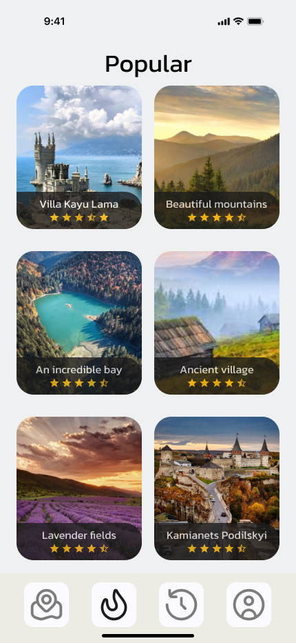
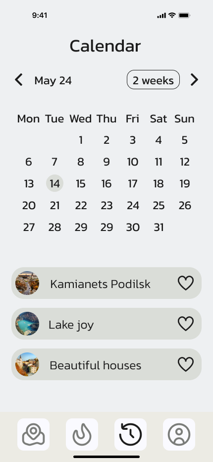

# Travely

Travely is a platform for discovering interesting interactive tours. Residents and visitors of the city who want to spend their time actively can generate walking routes in our application. It is mainly aimed at tourists who want to visit as many interesting places as possible within a limited time.

## Introduction

Have you ever arrived in a city and couldn't find interesting places to visit? How often have you felt tired from endlessly searching for interesting routes through the city on Google? How often did the route suggested by Google Maps turn out to be illogical and uninteresting? If you recognized yourself in at least one of these situations, then you need our application.

## Features

- **Filtering by initial geolocation**
- **Filtering by radius**
- **Filtering by places**

## Getting Started

This project is a starting point for a Flutter application.

A few resources to get you started if this is your first Flutter project:

- [Lab: Write your first Flutter app](https://docs.flutter.dev/get-started/codelab)
- [Cookbook: Useful Flutter samples](https://docs.flutter.dev/cookbook)

For help getting started with Flutter development, view the [online documentation](https://docs.flutter.dev/), which offers tutorials, samples, guidance on mobile development, and a full API reference.

## Installation

To get started with this Flutter project, follow these steps:

1. **Clone the repository:**

   ```bash
   git clone https://github.com/your-username/travely.git





