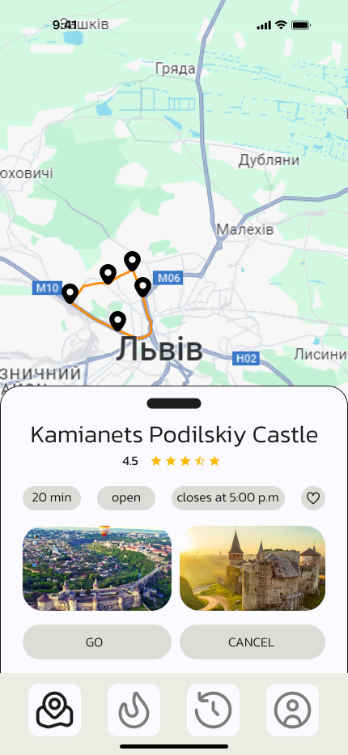

Travely is a platform for discovering interesting interactive tours. Residents and visitors of the city who want to spend their time actively can generate walking routes in our application. It is mainly aimed at tourists who want to visit as many interesting places as possible within a limited time.

## Introduction

Have you ever arrived in a city and couldn't find interesting places to visit? How often have you felt tired from endlessly searching for interesting routes through the city on Google? How often did the route suggested by Google Maps turn out to be illogical and uninteresting? If you recognized yourself in at least one of these situations, then you need our application.

## Features

- **User-friendly and easy-to-understand design**
- **Practicality and adaptability to all devices**
- **Functionality that will be improved over time**
- **Speed and quality of route generation**
- **Special route search based on user preferences**
- **Availability of filters to sort routes by distance, type of walk, and starting point**
- **Ability to become a moderator and review other users' routes**
- **Moderators earn points that can be used later to purchase premium routes**
- **Calendar for viewing previously completed routes**
- **Ability to revisit and complete routes again**
- **Filtering by initial geolocation**
- **Filtering by radius**
- **Filtering by places**

## Screenshots

## Video
https://github.com/sandrew338/Travely/assets/82502480/5044f215-a949-495e-8ce5-1cac4eb35074
